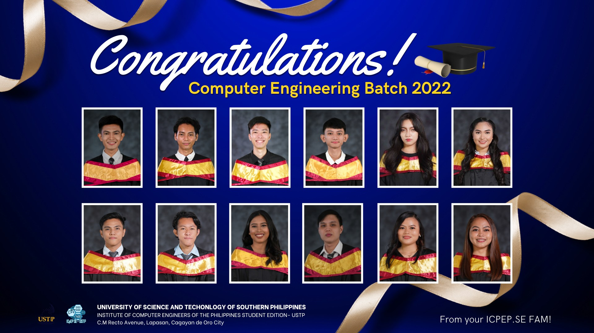
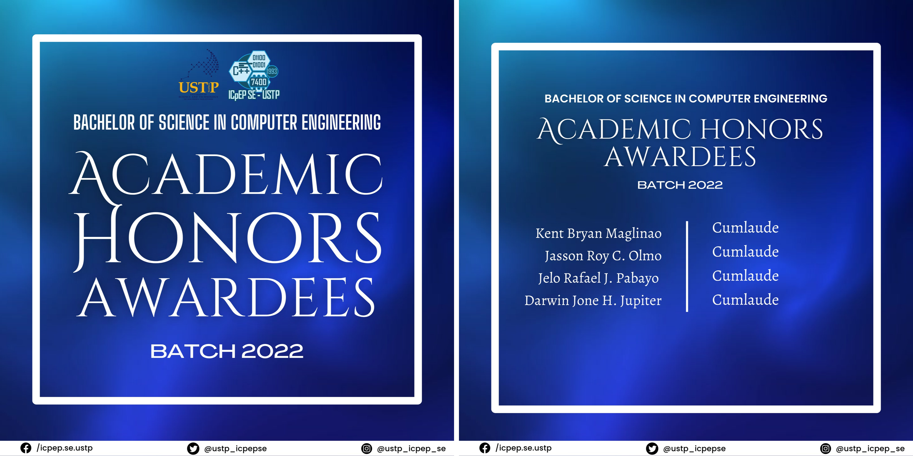

On the last 11th day of August in the year 2022, the ICpEP department proudly proclaims the 12 graduates of Computer Engineers Batch 2022 held at Limketkai Atrium. After four years of battling through the chosen study path, they have finally triumphed and reached the pinnacle of success with this degree. It is an honor to see that four of the batch's twelve graduates—the "Magic 12"—received the esteemed Latin Honors, Cum Laude. 

Achieving this degree is the biggest accomplishment for the Computer Engineering students. True enough, everyone had invested their time in studying, caused a lot of coffee wrappers every night, attended a number of meetings to polish their thesis papers, and other hidden struggles that they'd encountered during the four years of experience, including the two years of online classes. These set of faces undergo the challenging and magical adventures they struggle with as engineering disciples. As you dig deeper into the abyss darkness of their eyes, you can see their commitment to finish the quest and procure the enchanting paper, the diploma.

Congratulations and God bless to these 12 graduates of batch 2022. We wish you the best of luck as you embark and pursue your future careers. We knew that the Computer Engineering program was not an easy path, but these graduates showed that we could make it. Indeed, college life is not gentle  nor magical. We can't just say “OPEN SESAME!" or "ABRACADABRA!” and then expect success to pop up. It takes dedication, discipline, and hard work. These are the keys to unlock the magical doors, so that one day, we'll be able to say, "VIOLA!, I DID IT.".

 
