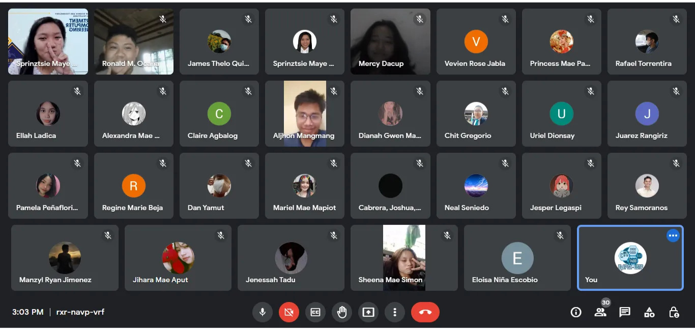

College is one of the most exciting and nerve-wracking chapter your student life would have to go through. It's a very different experience in comparison to our grade school and highschool experience. It's a whole new environment, culture, faces and system–and coming in unprepared wouldn't be a choice to the new Computer Engineering students of 2022. Fortunately, ICpEP.SE USTP implemented the bridging class program for the newcomers.

The ICpEP.SE Bridging Program served as the freshmen's jumpstart for their college life. With the K-12 Program in mind, one may remember the different classifications and specializations of students per strand. Therefore, each individual freshman came from different schools and different strands with, probably, different learnings. The bridging program will, then, serve as either a new knowledge or a review to the freshmen of computer engineering.

The 20-day program is held every weekday from July 25 to August 26. It took place online, using Google Meet as medium. The students were introduced to 4 most basic and relevant topics for computer engineering, and 4 handpicked tutors for each topic. These topics are Algebra, Trigonometry, Analytics Geometry, and Solid Mensuration with the corresponding tutors: Ms. Glycelle June Pangca, Ms. Ritzi April Lontoc, Mr. Darwin Jone Jupiter, and Ms. Sprinztsie Maye Garrucha.

A little over 45 students attended, and displayed great participation during the program. They asked questions frequently and answered on-the-spot questions from the tutors seamlessly. Each session was not just a formal tutorial but there was also a hint of bonding between the freshmen and their seniors and/or ICpEP.SE USTP co-members. With the efforts of the ICpEP.SE Bridging Program head–Robby William Sacote, facilitators–Ryand Ysteen Agnes, Gio Noval, Racel Antivola; and the tutors, the ICpEP.SE Bridging marked and ended successful on August 26th of 2022.

Although the program has ended, the journey of the future engineers has yet to start. May this program helped the freshmen start up their college journey and may it also helped them warm up to their ICpEP.SE USTP co-members. Just like what John Maxwell coined "Teamwork makes the Dream Work".