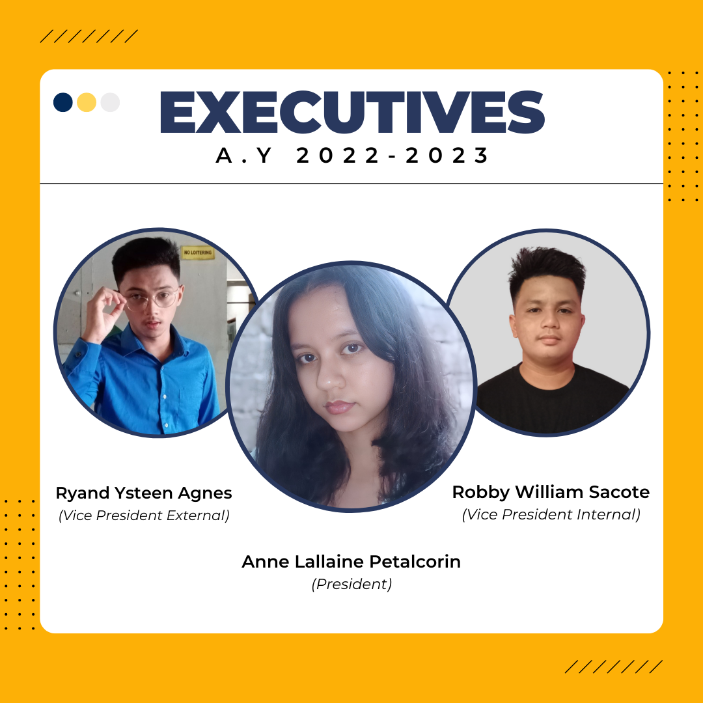
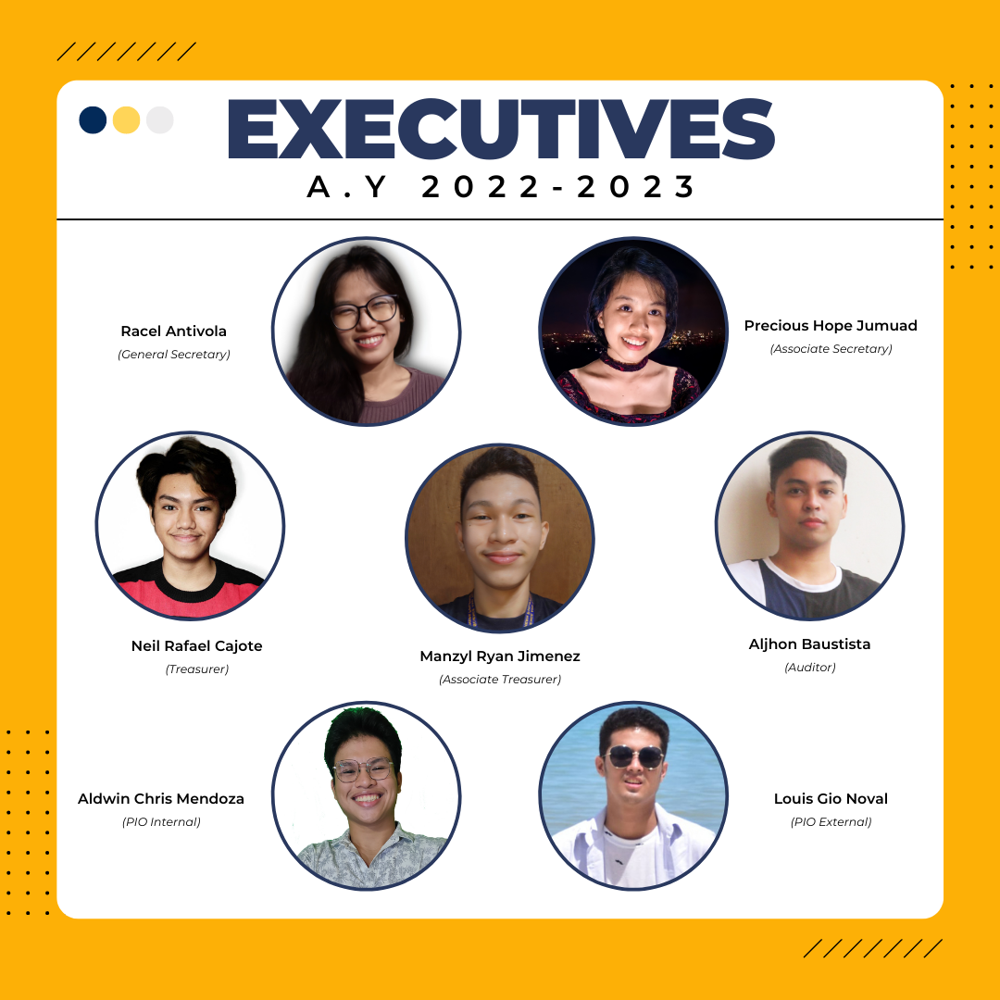
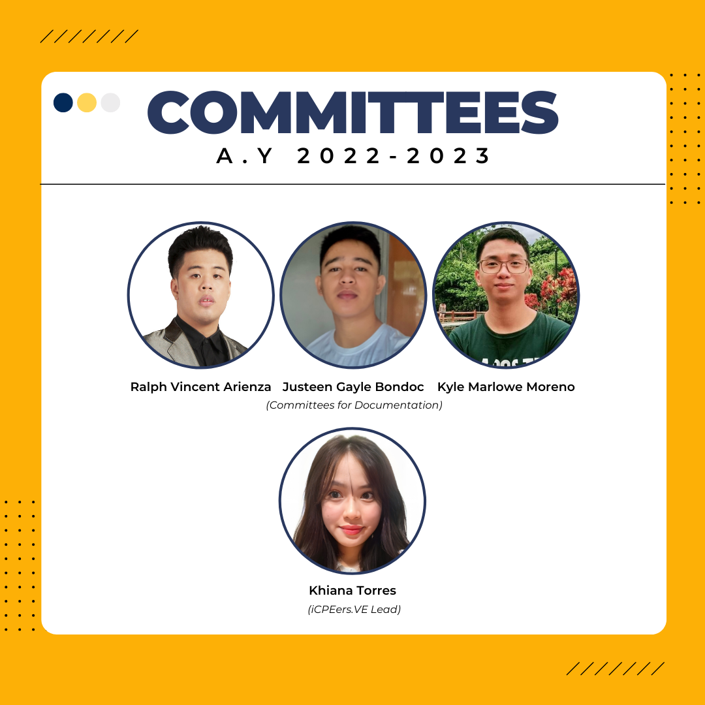
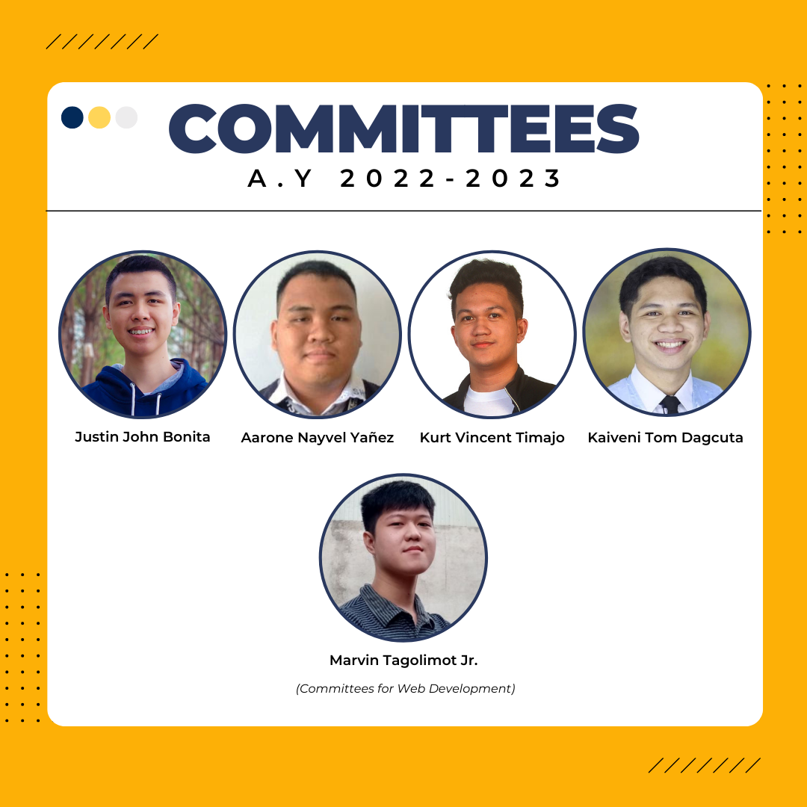
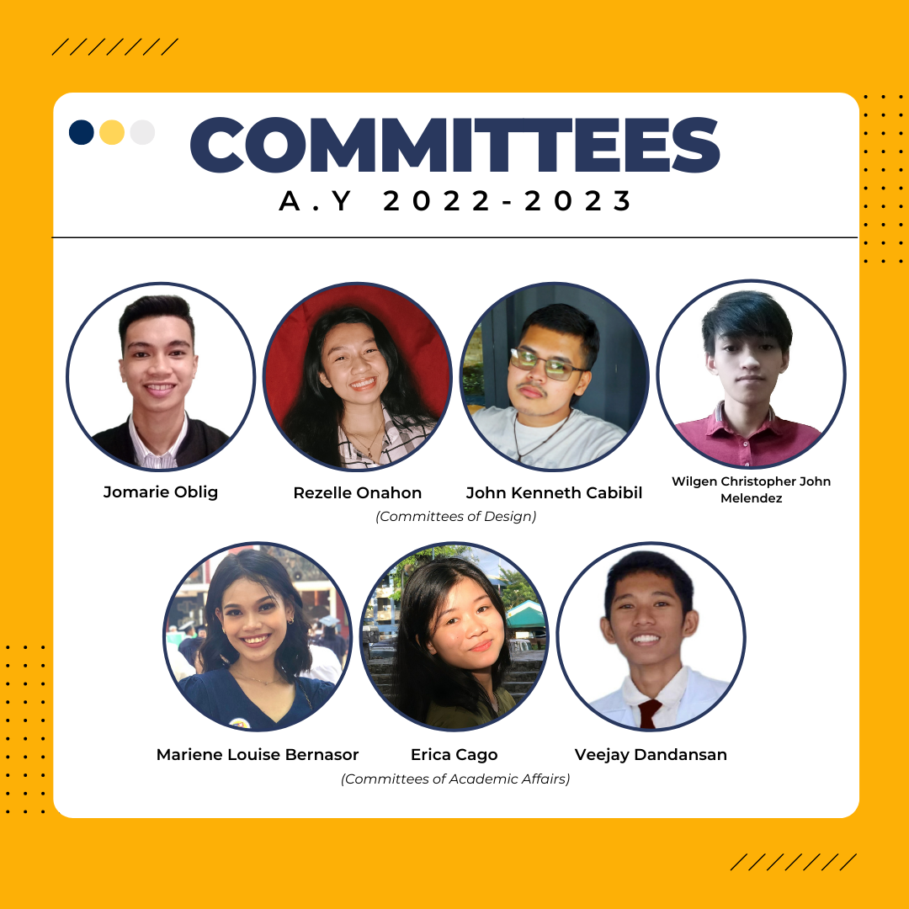
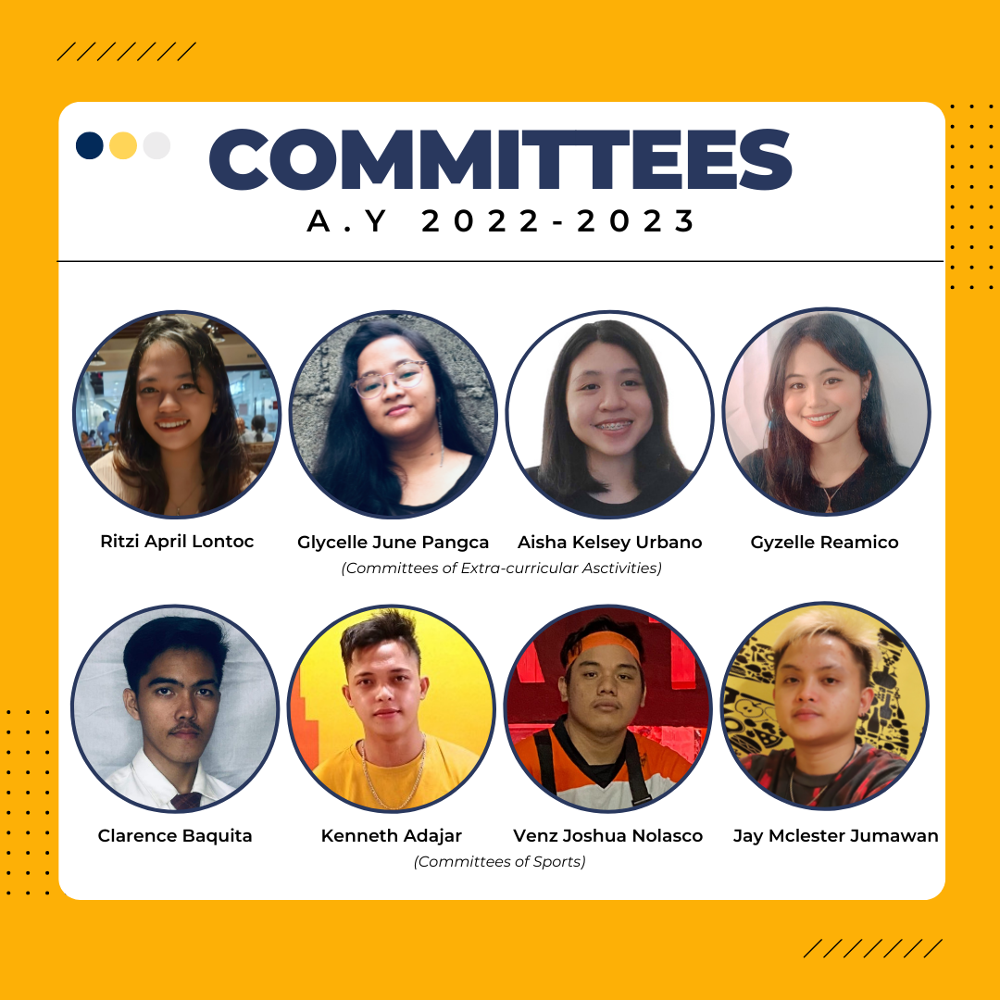

The ICpEP.SE officers of A.Y. 2021–2022 have bid farewell. A term that comes to an end does not always mean the end of a story. Sometimes, it means a new beginning. New stories that open doors of opportunities and responsibilities. A new generation of student leaders has arisen! As new faces join, new ideas and exciting activities await. A great leader comes with great responsibility that will give light and way to possibilities. This new set of officers will help in strengthening the department's foundation and serve the students in building camaraderie with the utmost excellence. Amaroks! We are pleased to introduce the newly elected executive officers and appointed committees for ICpEP.SE A.Y.2022–2023.

This post was written by: ICpEP.SE - USTP | Trisha Jane Barranco