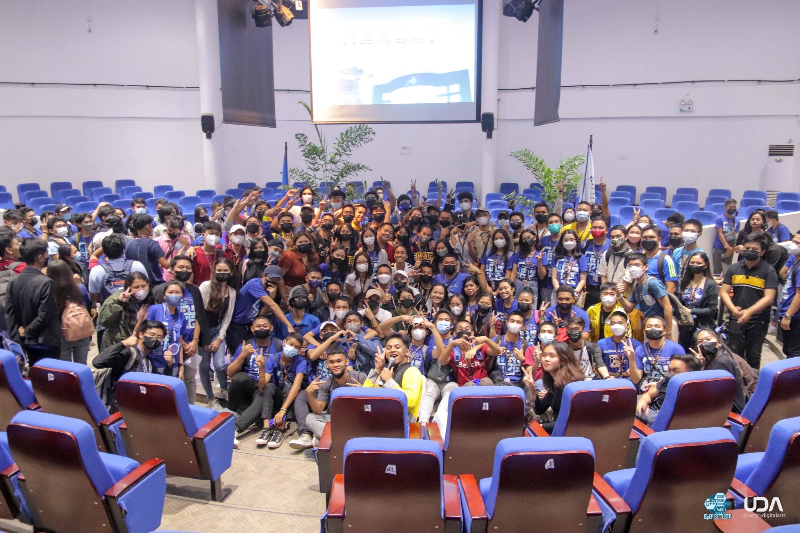

This year’s CPE General Assembly with the theme REBOOT is a refreshing event for the CPE students and the ICpEP.SE – USTP members. As we come back to the face-to-face modalities while still implementing a new normal, this program has engraved in the memories of the participants to look back and reminisce. Despite the challenges of transitioning into a new modality, the organization pushed through making this happen. 

This event took inspiration from the REBOOT concept. Reboot, which also means to refresh or restart, is truly a refresher for the CPE students as they start their academic year in a new learning modality. It is neon-themed and cyber-punky in motif to highlight the bright-colored possibilities of the new school year. To add to the hype, some students came in cosplay inspired by the game and animated series Cyberpunk Edge runners. They were featured during the event and given chance to flaunt their outfits.

On the technical side, the organization has made careful preparations before the event. One is that the students in the Computer Engineering department are encouraged to register in the google forms circulated online. The event took place at the Performing Arts Theater last November 16, 2022, and is fully face-to-face catering to more or less 300 students and faculties in the venue.

The program flow consists mainly of talks regarding the department and the organization which all aim to acquaint the freshmen with the department and the organization’s culture. The major talks include a warm welcome by the ICpEP.SE - USTP moderator and CPE Department Chairman, Engr. Rodesita S. Estenzo, an inspirational message by Engr. Jovanni Auxilio, a USTP CPE alumnus, and the introduction of the ICpEP.SE - USTP members, history, and its Annual Work and Financial Plan for this academic year, 2022-2023, delivered by the ICpEP.SE - USTP President, Ms. Anne Lallaine Petalcorin.

There were also entertainment breaks and games for the participants to take part in. Each department was also able to shout out their chants during a part of the program. At the end of the event, announcements regarding the ICpEP.SE - USTP Tagline Making Contest, the CPE Logo Making Contest, the CPE departmental shirt batch 3 opening, etc. were made.

The organization relayed all of its deliverables accordingly and received positive feedback. One participant even quoted,

> I like the line "REBOOT". I hope this brings a change, it won't be fast, but I hope the Reboot is fast enough for the higher level to enjoy the change because time, though the line is cliche, is gold, and our time here in USTP won't last that long.

Overall, it was a very fruitful and successful event. To recapitulate the happenings, follow this link for the [picture compilation](https://www.facebook.com/icpep.se.ustp/posts/pfbid0LWUnwATaVh6T3gza3fgaixx2oQtKjQyTBFLWcjQCP15WyRXyq6McuQTK9JUf7zsYl). Also, follow [ICpEP.SE – USTP](https://www.facebook.com/icpep.se.ustp) for more vibrant programs. Looking forward to a more colorful world of events and activities brought to you by ICpEP.SE – USTP.