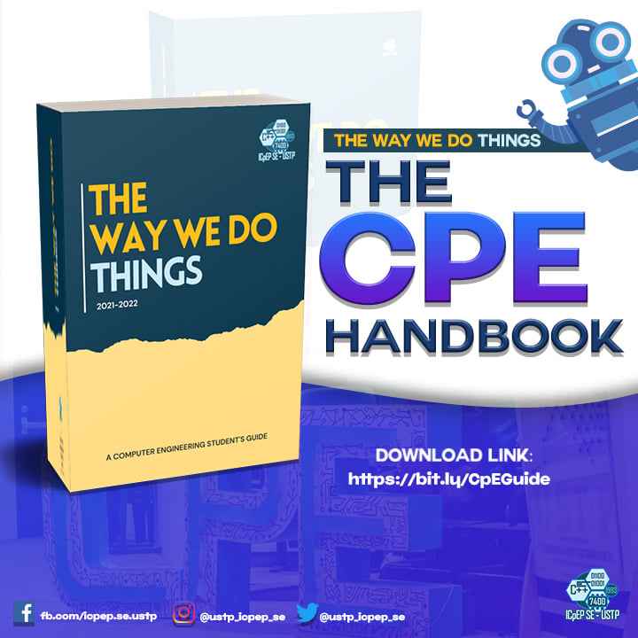

It’s been almost two and a half years since the pandemic emerged, also maybe some of you just started your final years of high school. Since then, our learning modalities shifted to a virtual paradigm. We, especially students, were all in the same storm but in different boats. Some had a rocky, uncomfortable experiences, some may have an easy ride. Nevertheless, our experiences all had a common denomination and that is, we survived. Yes! We survived! Take it in for a moment, then breathe out to realize that you are a collegian now! You are now adults ready to enter a new milestone in your life. But don’t be afraid for we are here to help you in your transition with the ultimate starter pack!

**1.  THE HOME OF THE TRAILBLAZERS – USTP**

Welcome to your new home, trailblazers! What is the number one thing you should do in a new environment? Of course, to know about it. Some of you maybe consider USTP as your dream school, some may be enchanted by the college courses offered, or some wanted to enjoy the free quality education offered here. Whatever it may be, a lot of you are sufficiently knowledgeable of our beloved university after your intensive research before taking the entrance exam (surely). Still, here is a snippet of the USTP description:

The University of Science and Technology of Southern Philippines (USTP) is a state university established on August 16, 2016 by virtue of Republic Act 10919 through the amalgamation of the Mindanao University of Science and Technology (MUST) in Cagayan de Oro City, Misamis Oriental and the Misamis Oriental State College of Agriculture and Technology (MOSCAT) in Claveria, Misamis Oriental. Both campuses are located in Northern Mindanao, the Gateway to Mindanao, which offers a strategic locational advantage for the institution to train and develop students from all the other regions of Mindanao.

Curious? You can learn more about USTP here [USTP Homepage](https://www.ustp.edu.ph/)

**2.  YOUR COURSE - COMPUTER ENGINEERING**

The Bachelor of Science in Computer Engineering is a course for individuals who are interested in creating something through technology may it be software, hardware, or processes. It is a four-year degree where computer science and electrical engineering is combined together. It is one of the top-in-demand careers for young aspirants. It covers topics on how to design a microprocessor and develop embedded systems that are used in desktops or handheld devices. The program also equips students with the ability to analyze, plan, design, install, operate and maintain digital devices, computer hardware, and software systems. In this field, your logical and reasoning skills are required. Since computer engineering integrates computer science and electrical engineering you will also be exposed to a lot of programming and electronic circuits.

To know more about CpE follow this link for the guide book [CpE guide book](https://bit.ly/CpEGuide)

**3.  THE ICpEP.SE – USTP**

The Institute of Computer Engineers of the Philippines Student Edition - USTP (ICpEP.SE – USTP) is a non-profit student organization of computer engineers in University of Science and Technology of Southern Philippines. Its professional organization, the ICpEP, is registered under the Securities and Exchange Commission as a non-stock and non-profit organization. ICpEP.SE-USTP is the immediate embodiment of the students of BS Computer Engineering under the College of Engineering and Architecture of USTP. Its members and officers comprised of BSCPE students. For more information and coordination with the organization, please follow this link [ICpEP.SE FB](https://www.facebook.com/icpep.se.ustp).

**4.  TRANSITIONING TO A NEW CHAPTER IN YOUR LIFE  - Expand Your Social Circle**

Entering a new milestone in our life, especially college, is a mix of intimidating and exciting emotions. We know what we had to do but at the same time we don’t know what will happen to us. That is why we need acquaintances to share and empathize with our feelings. Surely, making friends in college is scary. We may have friends before in high school whom we share university, but the certainty that they will also share the same course or block is unlikely. Whether you are an outgoing person, or prefer to be alone, friends always help us along our college journey. Even for extroverts, making friends is scary. We don’t know whom we trust or rely on. Overall, it’s scary. We feel pressured to find one as soon as possible for its not only for socializing purposes but also for educational ones. But fear not! The USTP trailblazers are a friendly bunch of students whom we can share interests and sentiments, especially your Computer Engineering family. Below are some constructive tips to broaden your social circle:

***You are not alone***

Yes, take it in – you are not alone. Along with you are hundreds of freshmen who are afraid, intimidated, and maybe in despair. You’re not the only new kid so the attention is not just on you. This means that you do not need to feel pressured. All of you are nervous and maybe are trying to desperately reach out to fellow freshmen or to seniors. And of course, seniors are as nervous as you are too. They have experienced a different social situation and are also in cold-sweat anticipating this new academic year. So, don’t be afraid to put yourself out there. There are a lot of likeminded people like you just waiting to be reached out.

***Seek discomfort***

So short but so full. Truly, in college you should seek discomfort. This is not a statement to pressure you rather, it is to challenge you. College is a new milestone in life so maybe add few changes for the better. If you don’t feel comfortable reaching out then maybe this is your sign to finally reach out. Seek discomfort, do what you are challenged to do before. Say hi to that cutie you wanted to be friends with, because why not? Exchange social media links to your new classmates. Hang out with your newly found friends. If you’re afraid to build a social circle then build one now – seek discomfort.

***Don’t Sweat the Small Talk***

Small talk can be hard to make with strangers. All the usual questions are so cliché that the thought of asking them is cringe-worthy. “Where are you from?”, “What’s your major?”, and “What classes are you taking?” may feel like lines from a script, but getting the ball rolling in a conversation will typically lead to a more meaningful topic. They’re cliché because they work and plenty of friendships start with small talk.

***Join clubs or organizations***

This is the easiest way to build or broaden your social circle. The USTP-CDO campus has a lot of organizations in both academic and curricular areas. ICpEP.SE is one of them, so why not volunteer on becoming one of us? Surely, you’ll find friends who will empathize with your academic dilemmas here at the same time, contribute to your department as a volunteer. To register you can follow this link [ICPEERS Volunteers](https://www.facebook.com/icpep.se.ustp). Of course, your options are not limited to academic organizations. There are other curricular organizations that will surely pique your interest. The list can be found here [USTP-CDO](https://www.ustp.edu.ph/cdeo/).

***COLLEGE IS NOT A RACE***

In college, it's all about developing personally. It's a place where you won't be judged for making your own decisions, attempting novel things, or choosing your own route. With so much freedom, college students frequently join and leave buddy groups and social networks. There are lots of students that decide to move schools after a year or change their major in the middle of their studies, so you may always find new people and relationship prospects. You don't have to be concerned about missing out on anything in college; if you're willing to make new friends, you'll find them everywhere.

**5.  TRANSITIONING TO A NEW CHAPTER IN YOUR LIFE  - Find Your Niche**

In relation to broadening your social circle, you should at least know your niche. Whether you already know it or you are still in the process of knowing, finally figuring out what it is, is necessary in surviving college. So here are some tips we round up to guide you on your journey.

***Attend to your interests***

Surely, as Computer Engineering students, you may find that your interests point on technology and the use of it. If you are truly interested in these then invest on it. Well, of course we cannot invalidate those who feel that they only pursue this course for practical reasons, not by passion. A lot of us relates to that, but that doesn’t mean the end of the world for you. There are a lot of organizations that you may feel interested into. You may sign up to them and maybe enjoy your experience there. As you can see, your options are always available to you. You always have a choice as long as you attend to your interests.

***Be a Busy Bee***

College is very different from any school you’ve attended before. It’s large, overwhelming, and oftentimes complicated. You may feel like not feeling belong in it but, don’t falter. Be a busy bee! This means that you should try new things, find something that clicks. This is not to pressure yourself in pathetically finding your interests, but a step to finally realizing what it is. It’s better than doing nothing or to give up. So, be a busy bee!

***Know your student leaders***

Most of the student leader members are seniors who already know their way in the university. You can freely reach out to them with kindness and humility. You can even be one of them to get to know them. Volunteerism could be a clue to your niche, maybe it is your niche. If you’ve been in a student leadership organization in your lower years then joining one in college is no different. So, this is your sign. Reach out and join!

***Know your professors and instructors***

Your teachers make or break you. Do not believe that they just compute your grades and you’re the one making it, there might be facts in this statement but the larger point is that they make you. Yes, they make you, they form you, they influence you in every single way. It may be a challenge in knowing them, but you do not have to go all out Jollibee just to get their attention. Some professors and instructors are amiable as to introduce their selves to you. A friendly advice, you should try to get to know the faculty and staff in that department. They often offer office hours, and this can be a great way to make your presence known. In this way, you can find a place within that department that maybe a clue to your niche.

***Your time is precious***

Being young and enjoying it is a liberating experience, but a friendly advice, you should avoid getting to entitled in doing so. In college, you may find that time is always out of your hands. That there always not enough time for everything. That’s where the concept of “time is precious” comes in. Truly, a collegian’s time is precious. We should always delay gratification for more important things that mostly relates to our academics. Constructively, you should spend your free time doing something that will lead to productive work and social connections. Most of the time, it isn’t about “time management”, rather it is “self-management’’.

**6.  TRANSITIONING TO A NEW CHAPTER IN YOUR LIFE – Sleep**

It’s the season of sleeplessness and sleep deprivation again for young people like you. Just knowing this fact is a stress inducer. Research shows that the relationship of the sufficiency of sleep among students and their grades is direct. This means that as students get enough sleep, they also have amazing grades. Recent studies also point out the adverse effects of poor sleep among students with regards to their success in school which is directly proportional. To solve this issue, we have elaborated the advices to get enough sleep:

***Go to bed early***

The most common advice, go to bed early. Students should go to bed early enough to have the opportunity for a full night of sleep. Adults need about seven to eight hours of sleep each night.

***Bed = Sleep***

This is the only equation applicable to the most comfortable furniture in your dwelling. Do not do things in your bed that would distract you from sleeping such as studying, eating, watching movies or reading.

***Avoid caffeine***

This may be contradictory to what you observe from your seniors or what you do yourself to keep awake in doing academic stuffs. Still, avoid caffeine for it stays in your system for hours and can make it hard for you to fall asleep.

***You are not a panda***

Taking naps during classes is an inevitable circumstance for students like you. This maybe because you are sleep deprived. However, try to avoid this because you are not a panda who sleeps wherever they want whenever they wanted. If you take a nap, then keep it brief. Nap for less than an hour and make sure that in the evening you’ll replenish your missing sleep hours.

***Sleeping is sacred***

Just as you pay respects to God in going to church or pay respects to the food at your table as you eat with your family, pay respect to your body as you lay it to rest. Take some time to loosen up before going to bed. Get away from blue light emitting devices for even just a few minutes. Set your bed for sleeping, dim the lights in the evening and at night so your body knows it will soon be time to sleep. If you are a believer, pray before you finally sleep. In the morning, bask yourself in the sunlight to boost your alertness. This is so simple but also a calming way to end and to start your day.

And those are your short guide to sleeping sufficiently. Those who believe they have a sleep disorder should consult with their primary care physician or a sleep specialist. Following them is not compulsory, we are not nagging you to sleep, we aren’t your mom.

> So, there are your guides as a starter in the university. Take them
> slowly but surely. Don’t forget to keep going on your journey on
> achieving your dreams no matter how tough the going gets. Remember,
> whenever the going gets tough, the tough gets going. Padayon,
> Engineer!